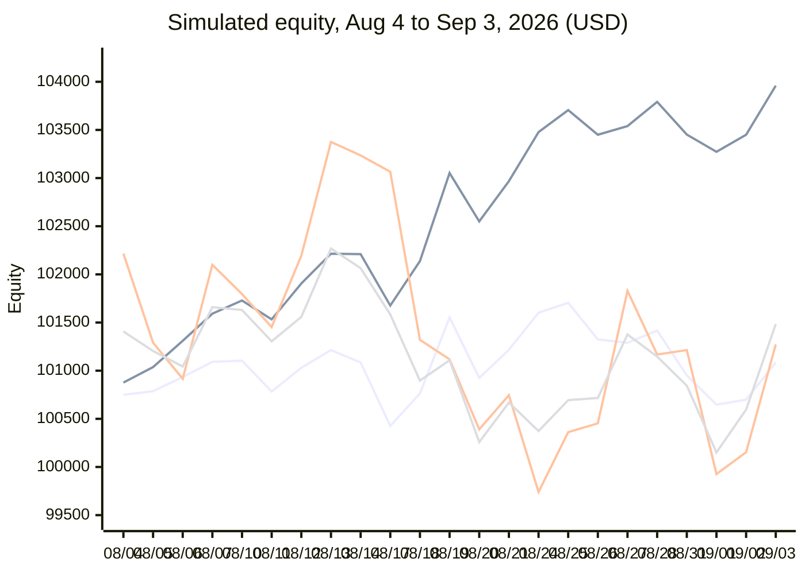

# ProductAdvisors Trading Agent

**Alpaca AI Trading Agents Hackathon, September 2026.** Team ProductAdvisors: Frank Villavicencio, Mihai Satmarean, Tashi, Vibhuti Singh. Paper account **PA3TPECBLC29**, started at $100,000 on August 28.

> An agent that measures what it does and cuts what loses.

Four independent strategy sleeves on one Alpaca paper account. Every entry, exit, size and stop is deterministic. Two self-hosted model councils sit where judgment genuinely helps, and neither can place an order. When the broker's own fill ledger said a sleeve was losing, the agent retired it mid-competition, then re-admitted it only behind a gate it had measured first.

| Live account, Sep 3 | 30-day simulation, bars only | Automated tests |
|---|---|---|
| **$100,552** · +$989 today (+0.99%) · +$552 since start | **$101,085** · +1.08% · max drawdown -1.04% · QQQ +1.27%, SPY +1.48% | **665** · 73 merged PRs in 7 days · every risk guard mutation-tested |

The interactive version of this page, with the hover chart and series toggles, is [`docs/presentation.html`](presentation.html) (rendered: https://htmlpreview.github.io/?https://github.com/mihai-satmarean/alpaca-trading-agents/blob/main/docs/presentation.html).

## What it is

One coordinator, four sleeves, budgets enforced from the broker's book. Each sleeve's capital budget is recomputed from Alpaca's positions every cycle, never from the strategy's own counters. A sleeve cannot be charged for another's holdings, and a sleeve over budget stops buying.

| Sleeve | What it does | Signal |
|---|---|---|
| **SIXFOLD** (75%) | Long quality names from 18 large caps plus the S&P 400, 20 names max | Tashi's six-lens fundamental score (moat, ROIC, valuation regression, mismatch, capital signals, historical returns); buy above 60, sell below 40; a three-model council must approve each buy two to one, and it can only veto |
| **CSP** (15%) | Cash-secured puts, 7 to 45 DTE, delta under 0.30, open interest over 100 | Premium yield ranked, 30% per-name cap; option quotes through the Alpaca MCP server, and a contract it cannot quote is never priced; one covered call on the book's only round lot |
| **Pendulum** (5%) | Mean reversion on long-duration Treasuries (TLT) | 20-day z-score under −2.0 and RSI(2) under 10 at once; exits on reversion, RSI over 70, a 10-day time stop, or a 1.5×ATR hard stop; the same `decide()` runs in the backtest and live |
| **Vampire** (5%) | Bi-directional 5-second micro-scalper on QQQ and TQQQ | Retired on day 5 at −$663 over 10,470 real fills; re-admitted on day 7 behind an LLM regime gate that opens entries only in "chop"; exits never wait for the model |

## AI logic: the model only where ambiguity exists, and it never trades

Three self-hosted open models on a Dell4 cluster (a finance-tuned model, a general model, Qwen3) vote on every SIXFOLD buy. Two of three must agree, and they gate buys only: an outage can stop the system opening a position but never stop it leaving one.

The Vampire gets a second, narrower advisor: every 15 minutes it reads the last 30 one-minute bars and labels the regime. The engine opens lots only in "chop". The model labels; it never decides. When one model answered `"chop"` and `"trade": false` in the same object, we took the label and ignored the flag.

Fail closed, everywhere: a missing, stale or unparseable verdict, or an unreachable model, closes entries. Every verdict and every notification is journalled to a SHA-256 hash-chained log that the dashboard verifies on every load.

**Measured before it was wired.** Scored on 2,828 real fills across two sessions, bucketed into the 15-minute windows a gate rules on:

| Gate | Windows off | P&L removed | P&L kept | p (permutation) |
|---|---|---|---|---|
| dell4-finance | 1 of 49 | +$5 | −$106 | 0.73 |
| Efficiency ratio | 13 of 49 | −$60 | −$41 | 0.25 |
| **dell4-chat** | 22 of 49 | −$93 | −$8 | 0.20 |

The right sign and the largest effect, and not proof. The write-up says the same.

## Risk gates

- Per-trade cap 5% of equity, per-position 10%, $5,000 minimum cash, a 2% daily-loss breaker with a 30-minute cooldown, baselined on the broker's previous close so a restart cannot re-arm it.
- Fills are confirmed by polling the order to a terminal state, never assumed from the submit response. An unreadable fill is assumed filled: under-counting compounds, over-counting only trades less.
- An independent watchdog reads the broker's book every 20 seconds and contains a sleeve breach by stopping the agent and closing the sleeve, without consulting the agent's own opinion of its position.
- Rejected submissions count against the rate limiter and back off exponentially; the 4,700-reject storm of August 31 cannot recur.
- The intraday sleeve is flattened at 15:50 ET; multi-day sleeves and the options book are never touched by that path.
- A post-open health check runs as a separate process and reads its sleeve caps from the live config, so it cannot cry wolf against a stale number.

## What we measured, and what we cut

P&L attribution comes from the broker's fill ledger, never from engine counters. On day 4 HOOD and SPY were dropped from the Vampire after losing in every hour of a session. On day 5, across 10,470 real fills, the Vampire stood at −$663 while its internal counter claimed a large profit. A 5-second mean-reversion edge is smaller than the spread it pays. The sleeve was retired and its capital moved to SIXFOLD. Two latent defects in the risk layer were found the same way, from the live log, and fixed with tests that fail if they return.

On day 7 the Vampire came back at 5% behind the regime gate measured above, and posted its first gated session:

| Vampire, Sep 3 | Orders | Rejected | Realized |
|---|---|---|---|
| QQQ | 131 | 0 | +$10.30 |
| TQQQ | 495 | 0 | +$2.12 |
| **Total** | 626 | 0 | **+$12.42** |

Zero rejects all day. One session is a sign, not a result.

## 30-day simulation: this exact configuration since August 4, from $100,000

Real Alpaca daily bars (adjusted), the live rules and the live allocation (75 / 15 / 5 / 5 / 0), 23 sessions from 2026-08-04 to 2026-09-03. "Bars only" is the part that is fully replayable from price data: SIXFOLD marked daily plus Pendulum through its own `decide()`. "With CSP" adds a straight-line extrapolation of the CSP sleeve's realized premium. Benchmarks are buy-and-hold over the same sessions.

| Sleeve | Capital | 30-day P&L | Return | Basis |
|---|---|---|---|---|
| SIXFOLD (75%) | $57,031 deployed of $75,000 | **+$1,085** | +1.45% of sleeve, +1.90% on deployed | Real daily bars; whole-share lots at $3,750 per name, held from Aug 4 |
| CSP (15%) | $15,000 collateral target | +$2,876 | +19.17% | **Extrapolation** of $844 realized in 5 live sessions, scaled to 23; no historical option quotes on this plan; assignment risk not modelled |
| Pendulum (5%) | $5,000 | $0 | 0.00% | Zero entries: z-score reached −2.16 once, RSI never met the ≤10 condition at the same time; the rule is built to be rare |
| Vampire (5%) | $5,000 | −$1,017 to +$286 | range | Between the pre-gate expectancy and the one gated session; neither is a forecast |
| **Bars only** | **$100,000** | **+$1,085** | **+1.08%** | Max drawdown -1.04% |

With the CSP extrapolation the ending equity is $103,960 (+3.96%); adding the Vampire's range gives $102,944 to $104,246. Over the same window, QQQ buy-and-hold returned +1.27% and SPY +1.48%.

**SIXFOLD per name** ($3,750 each, whole shares, bought at the August 4 open; $17,969 of the sleeve sat idle in whole-share rounding and the four unused slots, which mirrors the live book):

| Name | P&L | Name | P&L |
|---|---|---|---|
| HRB | +$568 | LLY | +$88 |
| AAPL | +$269 | PG | +$70 |
| NVDA | +$249 | COST | −$52 |
| META | +$214 | FHI | −$99 |
| ABBV | +$213 | HD | −$215 |
| MSFT | +$207 | AMZN | −$219 |
| V | +$171 | UTHR | −$225 |
| KO | +$100 | GOOGL | −$254 |

## What we don't claim

- **Two sessions of regime-gate data is a sign, not proof.** p = 0.20 would need roughly three times the 49 windows we have before it could settle either way.
- **This is a paper account.** Nothing here has met a real fill, a real borrow or a real margin call. Seven days cannot tell skill from luck on any sleeve.
- **The 30-day simulation's CSP line is an extrapolation.** This plan has no historical option quotes, so five live sessions' realized premium is scaled to 23. Assignment risk is not modelled. The bars-only line is the one to trust.
- **The Vampire signals off Alpaca's free IEX feed and fills against the consolidated book.** Live fills landed 12 to 47 cents from that feed's mid on QQQ. A consolidated feed would change its numbers more than any gate.
- **CSP sits at about twice its 15% target.** Our own morning check hid that for two days behind a hardcoded threshold; it now reads the live config.
- **The advisor call fails.** When it does, the engine logs it, closes entries, and moves on. Every failure is in the chained journal.

## Submission checklist

| Requirement | Evidence |
|---|---|
| Autonomous agent on the Trading API | alpaca-py for equities, options, IOC and DAY limit orders and closes; runs unattended on EC2 under systemd with a watchdog and a post-open verification timer |
| MCP server or CLI | The Alpaca MCP server (`alpaca-mcp-server` over stdio) supplies live option quotes to the CSP scanner, which refuses to price any contract it cannot quote |
| Options trading | Cash-secured puts on eight names (level 3), one covered call (KO $93, Oct 2), a disposal guard so no automated path can naked the call |
| Fresh $100k paper account | PA3TPECBLC29, started at $100,000 on August 28 |
| One-page write-up | [docs/WRITEUP.md](WRITEUP.md) |
| Public repository | github.com/mihai-satmarean/alpaca-trading-agents, 665 tests, 73 merged pull requests in seven days |
| Application URL | Live dashboard at `http://44.202.110.127:8501/` behind a fail-closed access token supplied on the submission form |
| Video and slides | [docs/presentation.html](presentation.html) is the deck; this file is its text equivalent |
| Team | Frank Villavicencio, Mihai Satmarean, Tashi, Vibhuti Singh · ProductAdvisors |

*Figures: live account as of September 3, 2026, 15:25 ET; simulation on Alpaca daily bars, August 4 to September 3, 2026, adjusted; Vampire gate scored on 2,828 real fills.*
